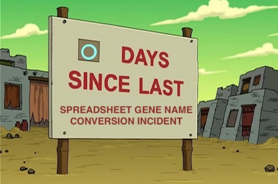

# HGNChelper Introduction

## Why HGNChelper?

Physicians and biologists like gene symbols and bioinformaticians
hate’em. Why? For one thing, they change constantly and are given new
names or aliases. For another, some get munged into dates when imported
into spreadsheet programs - and not only Excel (Thank you
[@karawoo](https://twitter.com/kara_woo) for the
[picture](https://twitter.com/kara_woo/status/1020054225022173184)!):



Myself (Levi speaking), I don’t mind them. It’s way easier to remember
[TP53](https://www.genenames.org/data/gene-symbol-report/#!/hgnc_id/HGNC:11998)
than to remember
[7157](https://www.ncbi.nlm.nih.gov/gene?cmd=Retrieve&dopt=full_report&list_uids=7157)
or
[ENSG00000141510](https://www.ensembl.org/Homo_sapiens/geneview?gene=ENSG00000141510).
They’re a fact of life. So Markus Riester and I wrote HGNChelper to make
them a little more pleasant to bioinformaticians.

## HGNChelper functionality

HGNChelper has several functions that seemed useful back in the day when
we first wrote it, but really one has withstood the test of time and
remained useful:

``` r

checkGeneSymbols(x, unmapped.as.na = TRUE, map = NULL, species = "human")
```

`checkGeneSymbols` identifies HGNC human or MGI mouse gene symbols which
are outdated or may have been mogrified by Excel or other spreadsheet
programs. It returns a data.frame of the same number of rows as the
input, with a second column indicating whether the symbols are valid and
a third column with a corrected gene list.

``` r

library(HGNChelper)
#> Please cite our software :) 
#>  
#>  Sehyun Oh et al. HGNChelper: identification and correction of invalid gene symbols for human and mouse. F1000Research 2020, 9:1493. DOI: https://doi.org/10.12688/f1000research.28033.1 
#>  
#>  Type `citation('HGNChelper')` for a BibTeX entry.
human = c("FN1", "tp53", "UNKNOWNGENE","7-Sep", "9/7", "1-Mar", "Oct4", "4-Oct",
      "OCT4-PG4", "C19ORF71", "C19orf71")
checkGeneSymbols(human)
#> Maps last updated on: Sat Nov 16 10:35:32 2024
#> Warning in checkGeneSymbols(human): Human gene symbols should be all upper-case
#> except for the 'orf' in open reading frames. The case of some letters was
#> corrected.
#> Warning in checkGeneSymbols(human): x contains non-approved gene symbols
#>              x Approved   Suggested.Symbol
#> 1          FN1     TRUE                FN1
#> 2         tp53    FALSE               TP53
#> 3  UNKNOWNGENE    FALSE               <NA>
#> 4        7-Sep    FALSE            SEPTIN7
#> 5          9/7    FALSE            SEPTIN7
#> 6        1-Mar    FALSE MARCHF1 /// MTARC1
#> 7         Oct4    FALSE             POU5F1
#> 8        4-Oct    FALSE             POU5F1
#> 9     OCT4-PG4    FALSE           POU5F1P4
#> 10    C19ORF71    FALSE            TEKTIP1
#> 11    C19orf71    FALSE            TEKTIP1
```

As you see, it even helps fix capitalization. How does it fix those
Excel dates? I imported a column of all human gene symbols into Excel,
then exported using a whole bunch of available date formats. Then I kept
any that differed from the originals for HGNChelper’s map.

## Mouse gene symbols

Mouse genes work the same way, but you need to specify the argument
`species=mouse`:

``` r

checkGeneSymbols(c("1-Feb", "Pzp", "A2m", "E430008G22Rik"), species="mouse")
#> Maps last updated on: Sat Nov 16 10:35:32 2024
#> Warning in checkGeneSymbols(c("1-Feb", "Pzp", "A2m", "E430008G22Rik"), species
#> = "mouse"): x contains non-approved gene symbols
#>               x Approved Suggested.Symbol
#> 1         1-Feb    FALSE             Feb1
#> 2           Pzp     TRUE              Pzp
#> 3           A2m     TRUE              A2m
#> 4 E430008G22Rik    FALSE             <NA>
```

Mouse gene symbols containing any capital letter, except the first
character, can not be fixed. For example, ‘E430008G22Rik’ is a symbol
for [Abl1](https://www.informatics.jax.org/marker/MGI:87859) gene, but
we couldn’t fix it. [Suggestions
welcome](https://github.com/waldronlab/HGNChelper/issues) about how to
build a more complete map of valid symbols. To be on the safe side, you
could set `unmapped.as.na = FALSE` to keep unrecognized symbols as-is
and only correct ones that have a definitive correction.

## What exactly checkGeneSymbols does

HGNChelper does the following corrections:

1.  fix capitalization. For human, only **orf** genes are allowed to
    have lower-case letters.  
2.  fix Excel-mogrified symbols
3.  fix symbols that are listed as aliases to a more recent symbol in
    the [HGNC](https://www.genenames.org/) or
    [MGI](https://www.informatics.jax.org/) (MGI_EntrezGene_rpt)
    database.

Numbers 2 and 3 are done by comparing to a complete map of both valid
and invalid but mappable symbols, shipped with HGNChelper:

``` r

dim(mouse.table)
#> [1] 790110      2
dim(hgnc.table)
#> [1] 103939      3
```

These are a combination of manually generated Excel mogrifications that
remain constant, and aliases that can become out of date with time.

## Updating maps of aliased gene symbols

Gene symbols are aliased much more frequently than I can update this
package, like every day. We intentionally avoid automatic update of the
map to maintain reproducibility, because the same code from the same
version of HGNChelper could produce different results at any time with
automatic map update. If you want the most current maps of aliases, you
can either:

1.  use the
    [`getCurrentHumanMap()`](https://waldronlab.io/HGNChelper/reference/getCurrentMaps.md)
    or
    [`getCurrentMouseMap()`](https://waldronlab.io/HGNChelper/reference/getCurrentMaps.md)
    function, and provide the returned result through the `map=`
    argument of
    [`checkGeneSymbols()`](https://waldronlab.io/HGNChelper/reference/checkGeneSymbols.md),
    or
2.  See the instructions for updating your package locally at
    <https://github.com/waldronlab/HGNChelper> (it’s just one
    command-line command as long as you have R and
    [roxygen2](https://cran.r-project.org/package=roxygen2) installed)

## What does the expand.ambiguous argument do

As mentioned above genes symbols are aliased very frequently. It is
possible that a gene symbol which was earlier an alias is now an
approved symbol. ‘checkGeneSymbols()’ by default will give out only the
approved symbol of a gene. This can be an issue specifically when
analyzing an older dataset which may be referencing to a previously
aliased (now approved) gene symbol mapping to another approved symbol at
that time. This can be checked with ‘expand.ambiguous = TRUE’ which
gives out all the mapping of a gene symbol irrespective of whether it’s
an approved symbol.

``` r

checkGeneSymbols("AAVS1", expand.ambiguous = FALSE)
#> Maps last updated on: Sat Nov 16 10:35:32 2024
#>       x Approved Suggested.Symbol
#> 1 AAVS1     TRUE            AAVS1
checkGeneSymbols("AAVS1", expand.ambiguous = TRUE)
#> Maps last updated on: Sat Nov 16 10:35:32 2024
#>       x Approved   Suggested.Symbol
#> 1 AAVS1     TRUE AAVS1 /// PPP1R12C

checkGeneSymbols(c("Cpamd8", "Mug2"), species = "mouse", expand.ambiguous = FALSE)
#> Maps last updated on: Sat Nov 16 10:35:32 2024
#>        x Approved Suggested.Symbol
#> 1 Cpamd8     TRUE           Cpamd8
#> 2   Mug2     TRUE             Mug2
checkGeneSymbols(c("Cpamd8", "Mug2"), species = "mouse", expand.ambiguous = TRUE)
#> Maps last updated on: Sat Nov 16 10:35:32 2024
#>        x Approved Suggested.Symbol
#> 1 Cpamd8     TRUE  Cpamd8 /// Mug2
#> 2   Mug2     TRUE  Mug2 /// Cpamd8
```

## Where do I find HGNChelper?

- CRAN: <https://cran.r-project.org/package=HGNChelper>
- GitHub: <https://github.com/waldronlab/HGNChelper>

Please report any issues at
<https://github.com/waldronlab/HGNChelper/issues>
